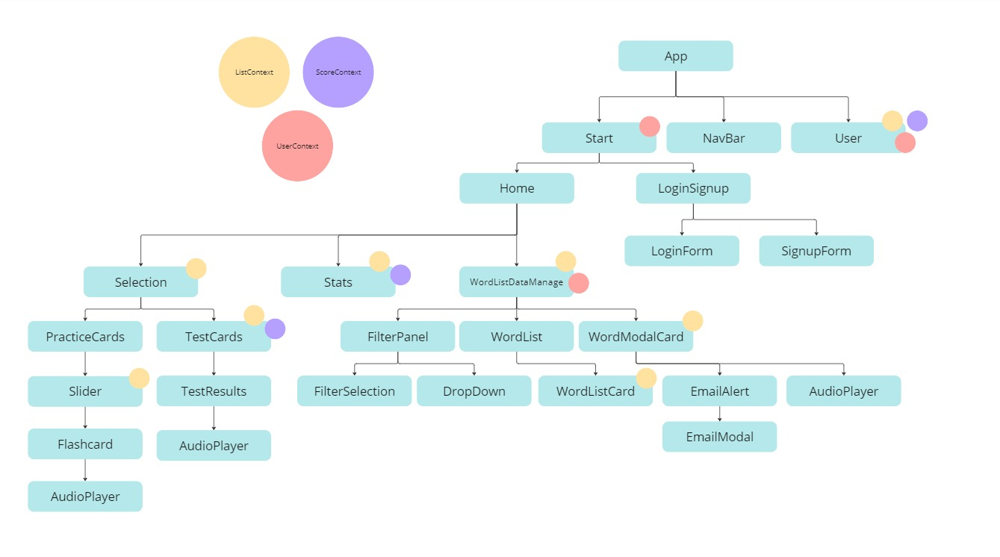

<!-- PROJECT LOGO -->
 

  

  <h3 align="center">1001 German Words</h3>
  <a href="https://1001germanwords.com">1001germanwords.com</a>
  

    This is a project I started to help me hopefully improve my German and React/Springboot skills simultaneously!
     
    <a href="https://1001germanwords.com">View Demo</a>
    ·
    <a href="https://github.com/siobhanhardt/GermanFlashcardApp/issues/new?assignees=&labels=bug&projects=&template=bug_report.md">Report Bug</a>
    ·
    <a href="https://github.com/siobhanhardt/GermanFlashcardApp/issues/new?assignees=&labels=enhancement&projects=&template=feature_request.md">Request Feature</a>
  

<!-- ABOUT THE PROJECT -->
## About The Project

![Product Name Screen Shot][product-screenshot]

This site is inspired by a few videos I have seen online about language learning that suggest learning the top 1000 words is a good way to start learning a language. I already had some German but felt that this was a good way to get back into things. I wanted to be able to use flashcards to practice, and to be able to pick exactly which type of words I wanted to study. I also wanted to be able to test my knowledge and keep track of how many words I had learned.

(<a href="#readme-top">back to top</a>)

## Creating the Word Database
I used a list of german words pulled from subtitles that I got from [here](https://en.wiktionary.org/wiki/Wiktionary:Frequency_lists/German_subtitles_1000). It may not be the most accurate representation but I did not find that any other lists that were much better. The main issue with this list is that it has all forms of a word, so for example you will see 'habe' and 'haben' which both mean 'have'. I ran the list of words through a [german dictionary API](https://en.pons.com/p/online-dictionary/developers/api).
I was able to eliminate some repeats this way as it would generally spit out the infinitive form of a verb for example. Unfortunately there were cases, like with 'habe' for example, where there is a noun 'Habe' which means 'property' and that would be added to the list, when that probably isn't in the top 1000 words. I also got the translation, word type and example sentence from this API. I had to do a lot of manual cleanup to remove some words, update translations and example sentences. There is definitely some words in there that are unlikely to be in the top 1000 of everday speech, that are heavily influenced by popular themes in movies and tv like crime dramas for example.

I also created a second table for conjugating irregular verbs, which I manually entered, as luckily the list wasn't too long.
## React Structure

## Deploying

I deployed the backend of the app using Docker and a VM on Google Cloud. I created the docker image and uploaded that to Docker Hub. I then used Docker Compose to create my containers on my VM. I ended up putting the MYSQL database directly onto the VM as it made the requests a little quicker. I used NPM Proxy Manager to re-route the IP address of the VM to use a subdomain of the domain I had purchased.

## Built With

* [![React][React.js]][React-url]
* 
* 
* 
* 
* 
* 
* 
* 
* 
* 

(<a href="#readme-top">back to top</a>)

<!-- USAGE EXAMPLES -->
## Usage

(<a href="#readme-top">back to top</a>)

<!-- MARKDOWN LINKS & IMAGES -->
<!-- https://www.markdownguide.org/basic-syntax/#reference-style-links -->
[contributors-shield]: https://img.shields.io/github/contributors/othneildrew/Best-README-Template.svg?style=for-the-badge
[contributors-url]: https://github.com/othneildrew/Best-README-Template/graphs/contributors
[forks-shield]: https://img.shields.io/github/forks/othneildrew/Best-README-Template.svg?style=for-the-badge
[forks-url]: https://github.com/othneildrew/Best-README-Template/network/members
[stars-shield]: https://img.shields.io/github/stars/othneildrew/Best-README-Template.svg?style=for-the-badge
[stars-url]: https://github.com/othneildrew/Best-README-Template/stargazers
[issues-shield]: https://img.shields.io/github/issues/othneildrew/Best-README-Template.svg?style=for-the-badge
[issues-url]: https://github.com/othneildrew/Best-README-Template/issues
[license-shield]: https://img.shields.io/github/license/othneildrew/Best-README-Template.svg?style=for-the-badge
[license-url]: https://github.com/othneildrew/Best-README-Template/blob/master/LICENSE.txt
[linkedin-shield]: https://img.shields.io/badge/-LinkedIn-black.svg?style=for-the-badge&logo=linkedin&colorB=555
[linkedin-url]: https://linkedin.com/in/othneildrew
[product-screenshot]: images/home.png
[Next.js]: https://img.shields.io/badge/next.js-000000?style=for-the-badge&logo=nextdotjs&logoColor=white
[Next-url]: https://nextjs.org/
[React.js]: https://img.shields.io/badge/React-20232A?style=for-the-badge&logo=react&logoColor=61DAFB
[React-url]: https://reactjs.org/
[Vue.js]: https://img.shields.io/badge/Vue.js-35495E?style=for-the-badge&logo=vuedotjs&logoColor=4FC08D
[Vue-url]: https://vuejs.org/
[Angular.io]: https://img.shields.io/badge/Angular-DD0031?style=for-the-badge&logo=angular&logoColor=white
[Angular-url]: https://angular.io/
[Svelte.dev]: https://img.shields.io/badge/Svelte-4A4A55?style=for-the-badge&logo=svelte&logoColor=FF3E00
[Svelte-url]: https://svelte.dev/
[Laravel.com]: https://img.shields.io/badge/Laravel-FF2D20?style=for-the-badge&logo=laravel&logoColor=white
[Laravel-url]: https://laravel.com
[Bootstrap.com]: https://img.shields.io/badge/Bootstrap-563D7C?style=for-the-badge&logo=bootstrap&logoColor=white
[Bootstrap-url]: https://getbootstrap.com
[JQuery.com]: https://img.shields.io/badge/jQuery-0769AD?style=for-the-badge&logo=jquery&logoColor=white
[JQuery-url]: https://jquery.com 
